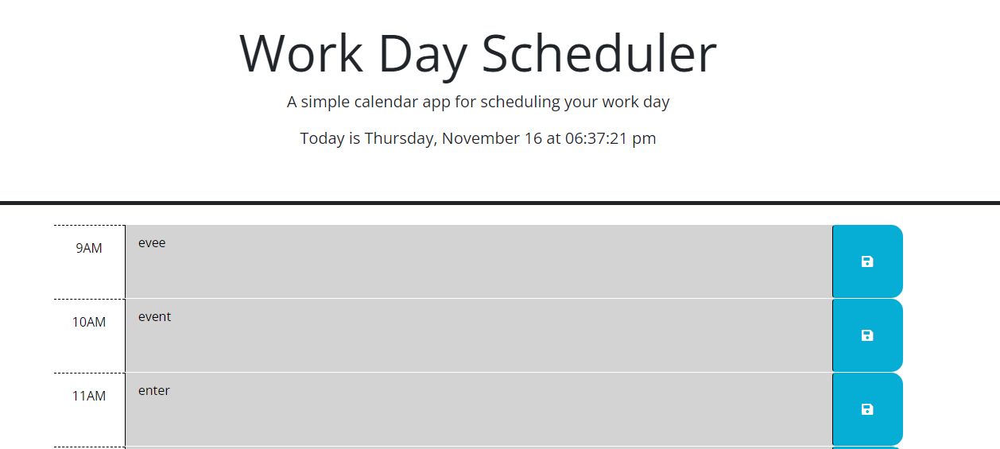

# day-planner

## Description

Challenge 5 -- Third-Party APIs: Work Day Scheduler

This was a project to finish starter code in order to produce a simple calendar application that allows a user to save events for each hour between 9 am to 5 pm of a work day, show an up-to-date time and date at the top, and dynamically changing color on each time block to indicate if a time block is in the past, present or future compared to the current time. Throughout this project, I learned about dayjs and how to utilize its functionality & I learned how to implement jquery in order to quickly, and consicely, code functions to a cleaner line instead of a large code block to output the desired functionality. 

## Usage

URL of deployed site: 

Screenshot of deployed site:

## Credits

README template used from: https://coding-boot-camp.github.io/full-stack/github/professional-readme-guide edX Boot Camps LLC. (2022, October 27). Professional readme guide. Professional README Guide | The Full-Stack Blog. https://coding-boot-camp.github.io/full-stack/github/professional-readme-guide
